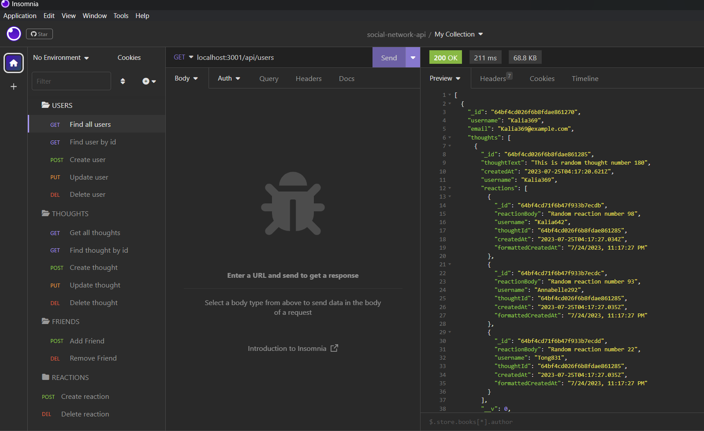

# social-network-api

The social network api is developed so it can be used for applications where users can interact with each other. 

## Technologies Used

- Node.js
- Express.js
- MongoDB
- Mongoose
- Insomnia
- JavaScript

## Description

The social network api allows users to share thoughts and reactions as well as add or remove friends. They also have the ability to update things, such as, their user information, thoughts and reactions. Since the API uses a NoSQL database, it is able to handle large amounts of unstructured data. 

## Visual

## Usage

- To install all dev dependencies, run "npm install" in the terminal.
- To seed the data, run "npm run seed" in the terminal.
- To start the server, run "npm run dev" in the terminal.

## Walkthrough Video Link

## Author & Contributors

- https://github.com/adorahtho 
- edX Boot Camps